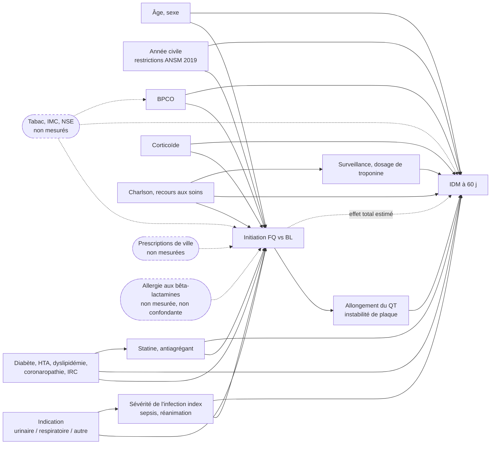

# Protocole

Numérotation alignée sur les items 1 à 12 de STROBE (+ RECORD). Chaque décision prise dans `01-question.md` est reprise, pas rediscutée. `CONTEXT.md` est absent dans cet exemple : les sources de données sont décrites de façon générique et à confirmer dans `03-phenotypes.md` et `04-faisabilite.md`.

## 1. Titre et résumé

**Titre** : Initiation d'une fluoroquinolone et risque d'infarctus du myocarde à 60 jours : cohorte de nouveaux utilisateurs avec comparateur actif, émulation d'un essai cible sur l'entrepôt de données de santé du CHU de Brest, 2015–2024.

**Résumé** (≤ 150 mots). Les fluoroquinolones font l'objet de restrictions ANSM/EMA depuis 2019 ; le signal cardiaque (infarctus du myocarde, IDM) reste débattu. Nous émulons un essai cible dans l'entrepôt de données de santé (EDS) du CHU de Brest : adultes recevant une première prescription hospitalière validée d'une fluoroquinolone (bras FQ) ou d'une bêta-lactamine comparatrice (amoxicilline ± acide clavulanique, céphalosporine de 3e génération ; bras BL) entre le 2015-01-01 et le 2024-12-31, sans antibiotique de l'un ou l'autre groupe dans les 180 jours précédents, avec 2 ans d'historique observé et sans IDM antérieur. Le temps zéro est la date de la prescription. Le critère principal est un IDM hospitalisé (DP I21.*/I22.*) entre J1 et J60. L'analyse principale est un modèle de Cox pondéré par l'inverse de la probabilité de traitement (IPTW), assorti de la différence de risque à 60 jours ; analyses de sensibilité par biais anticipé (délai de latence, phénotype étroit, risques concurrents, critère contrôle négatif, E-value).

## 2. Contexte et justification

**État des connaissances.** Les fluoroquinolones (FQ) allongent l'intervalle QT et dégradent le collagène des tissus conjonctifs, mécanisme retenu pour les tendinopathies et l'anévrisme ou la dissection aortique qui ont motivé les restrictions de l'EMA (2018) et de l'ANSM (2019). Un effet sur les évènements coronariens aigus a été suggéré par des cohortes sur bases médico-administratives à Taïwan et au Danemark, avec des hazard ratios de 1,0 à 1,7 selon le comparateur et la fenêtre (littérature, à vérifier ; références à collecter pour `06-rapport.md`). Les résultats sont discordants et sensibles à la confusion par indication : les FQ sont prescrites dans des infections plus sévères, ou chez des patients allergiques aux bêta-lactamines, et l'infection elle-même augmente transitoirement le risque d'IDM.

**Ce qui manque.** Aucune étude française sur données hospitalières chaînées prescription-PMSI-biologie n'a comparé les FQ à un comparateur actif de même indication avec un temps zéro commun, ni confirmé le critère par la troponine.

**Pourquoi l'EDS peut répondre.** L'EDS du CHU de Brest chaîne, par un identifiant patient interne, les prescriptions hospitalières validées par la pharmacie (molécule, voie, dates), le PMSI MCO (diagnostics en DP/DR/DAS, mouvements), les résultats de biologie (troponine) et les décès intra-hospitaliers, sur dix ans. Il permet un schéma de nouveaux utilisateurs avec comparateur actif et une définition étroite du critère (code + troponine) inaccessible au SNDS. La limite principale, l'absence des prescriptions de ville, est traitée dans la section 9.

## 3. Objectifs

- **Primaire** : estimer l'effet de l'initiation d'une FQ, par rapport à l'initiation d'une bêta-lactamine comparatrice, sur le risque d'IDM à 60 jours, par le hazard ratio ajusté (IPTW) et la différence de risque à 60 jours.
- **Secondaires** :
  1. Effet en analyse per-protocol-like (censure au changement de groupe d'antibiotique).
  2. Effet sur le critère composite IDM ou décès à 60 jours.
  3. Effet par indication (urinaire, respiratoire, autre) et par classe d'âge (< 65 / ≥ 65 ans), avec test d'interaction.
  4. Incidence cumulée d'IDM à 60 jours par bras.

## 4. Schéma d'étude

**Schéma retenu** : cohorte rétrospective de **nouveaux utilisateurs** avec **comparateur actif**, conçue comme l'émulation d'un essai cible (Hernán et Robins). Justification d'après `epi-designs` § 3.1 : l'exposition est un traitement débuté à une date identifiable, le critère survient plus tard, la question est causale. Le comparateur actif de même indication est la parade structurelle à la confusion par indication ; le schéma de nouveaux utilisateurs exclut les utilisateurs prévalents ; le temps zéro commun exclut le temps immortel.

**Alternative rejetée** : la série de cas auto-contrôlée (exposition transitoire, critère aigu) aurait éliminé la confusion inter-individuelle fixe, mais elle suppose que l'évènement ne modifie pas la probabilité d'exposition ultérieure et que l'exposition est indépendante des périodes à risque ; or un IDM change la prescription d'antibiotiques (hospitalisation, contre-indications) et l'infection index est elle-même une période à risque. Elle est conservée comme piste exploratoire pour une étude ultérieure, pas comme analyse de sensibilité.

Tableau d'émulation de l'essai cible :

| Composante | Essai cible | Émulation dans l'EDS |
|---|---|---|
| Éligibilité | Adultes ≥ 18 ans hospitalisés ou vus au CHU de Brest entre 2015 et 2024, chez qui un antibiotique systémique est indiqué pour une infection urinaire, respiratoire ou autre ; sans FQ ni bêta-lactamine comparatrice dans les 180 jours ; sans IDM dans les 2 ans ; non en soins palliatifs ; sans syndrome coronarien aigu en cours | Mêmes critères, vérifiés au temps zéro sur les tables prescription, PMSI et patient : première prescription hospitalière validée d'un antibiotique d'un des deux groupes entre le 2015-01-01 et le 2024-12-31, aucune prescription de l'un ou l'autre groupe dans les 180 jours, ≥ 2 ans d'historique observé (≥ 1 contact), aucun séjour avec I21.*/I22.* en toute position dans les 2 ans, DP du séjour index ∉ syndrome coronarien aigu, séjour index sans Z51.5, pas de prescription des deux groupes le même jour (`03-phenotypes.md`) |
| Stratégies comparées | (A) Débuter une FQ systémique et la poursuivre selon la prescription ; (B) débuter une bêta-lactamine comparatrice (amoxicilline, amoxicilline-clavulanate, C3G) et la poursuivre selon la prescription | (A) Première prescription validée d'un J01MA.* oral ou IV ; (B) première prescription validée de J01CA04, J01CR02 ou J01DD.* oral ou IV. Fenêtre d'exposition = jours de prescription + 7 jours de grâce. Le bras est assigné par la molécule de la prescription index |
| Assignation | Randomisation | Assignation par le prescripteur, observée ; émulation par score de propension (régression logistique sur les confondants de la section 7) et pondération IPTW stabilisée ; équilibre vérifié par différences standardisées |
| Temps zéro | Randomisation = date de début du traitement | Date de début de la première prescription hospitalière validée de l'antibiotique index ; identique pour les deux bras ; l'éligibilité est vérifiée et le bras assigné ce jour-là |
| Suivi | De la randomisation à l'IDM, au décès, à la sortie de l'étude ou à 60 jours | De T0 (jour 0) au premier de : IDM (J1–J60), décès, dernier contact connu avec le CHU (censure administrative, voir § 12 et biais « perte de vue »), J60 ; fin de suivi au plus tard le 2025-03-01 |
| Critère de jugement | IDM adjudiqué | Séjour MCO avec DP I21.* ou I22.* débutant entre J1 et J60 (définition principale) ; définition étroite : plus troponine au-dessus du seuil du laboratoire dans les 48 h de l'admission ; définition large : I21.*/I22.* en toute position (`03-phenotypes.md`) |
| Contraste causal | Intention de traiter (effet de l'assignation) et per-protocol (effet de la poursuite) | Principal : ITT-like, bras assigné à T0, suivi 60 jours quels que soient les changements ; secondaire : per-protocol-like, censure à la première prescription de l'autre groupe (variable `switch_j`) |
| Analyse | Modèle de Cox en ITT ; per-protocol avec pondération par l'inverse de la probabilité de censure | Cox pondéré IPTW, variance robuste ; différence de risque à 60 jours par Kaplan-Meier pondéré ; sensibilités listées en section 9 et détaillées dans `05-plan-analyse.md` |

## 5. Cadre

| Élément | Valeur |
|---|---|
| Établissement | CHU de Brest (mono-centrique), entrepôt de données de santé |
| Période d'inclusion | Du 2015-01-01 au 2024-12-31 (temps zéro dans cet intervalle) |
| Fin de suivi | 60 jours après le temps zéro, au plus tard le 2025-03-01 |
| Snapshot de l'EDS | à compléter (date du dernier chargement, à reporter depuis `CONTEXT.md` ou l'équipe EDS) |

Choix de la période : 2015 est la première année de prescription informatisée supposée complète sur les séjours MCO (à vérifier dans `04-faisabilite.md` : courbe annuelle du nombre de prescriptions) ; 2024 est la dernière année entièrement codée au snapshot ; la période encadre la restriction ANSM de 2019, ce qui impose l'ajustement sur l'année civile (biais « confusion par le temps calendaire »).

## 6. Population

- **Critères d'inclusion** (vérifiables au temps zéro uniquement) :
  1. Âge ≥ 18 ans au temps zéro.
  2. Première prescription hospitalière validée par la pharmacie d'une FQ systémique (J01MA.*) ou d'une bêta-lactamine comparatrice systémique (J01CA04, J01CR02, J01DD.*), voie orale ou intraveineuse, débutant entre le 2015-01-01 et le 2024-12-31.
  3. Historique observé d'au moins 2 ans avant le temps zéro : au moins un contact (séjour, passage, prescription ou biologie) daté de plus de 2 ans avant T0, sans exiger de continuité.
- **Critères d'exclusion** :
  1. Prescription d'un antibiotique de l'un ou l'autre groupe dans les 180 jours précédant T0 (wash-out non respecté).
  2. Séjour avec I21.* ou I22.* en toute position dans les 2 ans précédant T0 (IDM antérieur).
  3. Prescription d'une FQ et d'une bêta-lactamine comparatrice le même jour (bras non assignable).
  4. Séjour index dont le DP est déjà un syndrome coronarien aigu (I20.0, I21.*, I22.*, I24.*).
  5. Séjour index de soins palliatifs (Z51.5 en DP ou DAS).
  6. Formes non systémiques (collyre, gouttes auriculaires, topique) : elles ne créent pas d'éligibilité.
  7. Patients ayant exercé leur droit d'opposition à la réutilisation de leurs données (exclus par l'équipe EDS avant extraction).
- **Temps zéro** : la date de début de la première prescription hospitalière validée d'un antibiotique de l'un des deux groupes, jour où l'éligibilité est vérifiée et le bras assigné, identique pour les deux bras. Un patient n'entre qu'une fois (première initiation éligible).
- **Look-back** : 2 ans avant T0, exigés pour l'inclusion ; les confondants sont mesurés dans cette fenêtre (et sur le séjour index jusqu'à T0 pour l'indication et la sévérité).
- **Wash-out** : 180 jours sans prescription de FQ ni de bêta-lactamine comparatrice avant T0 ; 2 ans sans IDM.

## 7. Variables

| Variable | Rôle (exposition / critère / confondant / modificateur) | Définition opérationnelle | Référence vers 03-phenotypes |
|---|---|---|---|
| Initiation d'une FQ | exposition | Première prescription validée d'un J01MA.* systémique à T0 | « Exposition aux fluoroquinolones » |
| Initiation d'une bêta-lactamine comparatrice | comparateur | Première prescription validée de J01CA04, J01CR02 ou J01DD.* systémique à T0 | « Comparateur : bêta-lactamines » |
| Infarctus du myocarde | critère principal | Séjour MCO avec DP I21.*/I22.* débutant entre J1 et J60 ; étroit : + troponine > seuil dans les 48 h ; large : toute position | « Infarctus du myocarde » |
| Décès | évènement intercurrent ; composant du critère secondaire 2 | Décès intra-hospitalier (table décès) ; statut vital INSEE si chaîné | « Décès et statut vital » |
| Changement de groupe (switch) | évènement intercurrent (per-protocol-like) | Première prescription de l'autre groupe entre J1 et J60 | « Exposition », « Comparateur » |
| Âge à T0 | confondant ; modificateur (< 65 / ≥ 65) | Années révolues à T0 | « Critères d'éligibilité » |
| Sexe | confondant | Sexe administratif | « Critères d'éligibilité » |
| Année civile de T0 | confondant | 2015 à 2024 | — |
| Indication | confondant ; modificateur | Urinaire / respiratoire / autre, d'après le DP du séjour index ou le champ indication de la prescription | « Indication » |
| Diabète | confondant | E10–E14, toute position, look-back 2 ans | « Comorbidités CIM-10 en look-back » |
| Hypertension artérielle | confondant | I10–I15, toute position, look-back 2 ans | idem |
| Dyslipidémie | confondant | E78.*, toute position, look-back 2 ans | idem |
| Coronaropathie hors IDM | confondant | I20.*, I25.*, toute position, look-back 2 ans | idem |
| Insuffisance rénale chronique | confondant | N18.*, toute position, look-back 2 ans | idem |
| BPCO (proxy du tabagisme) | confondant | J44.*, toute position, look-back 2 ans | idem |
| Indice de Charlson | confondant | Quan 2011 sur les codes du look-back 2 ans | idem |
| Nombre de séjours MCO dans les 2 ans | confondant (recours aux soins, détection) | Séjours hors séances, séjour index exclu | « Recours aux soins » |
| Statine | confondant | C10AA, prescription hospitalière dans le look-back ou à T0 | « Co-médications » |
| Antiagrégant plaquettaire | confondant | B01AC, idem | idem |
| Corticoïde systémique | confondant | H02AB, idem | idem |
| Sepsis | confondant (sévérité) | A41.*, R65.* sur le séjour index | « Sévérité de l'infection index » |
| Passage en réanimation | confondant (sévérité) | Mouvement en réanimation ou soins intensifs débuté au plus tard le jour de T0 | idem |
| Durée de prescription | descriptif ; définit la fenêtre d'exposition per-protocol | date_fin − date_debut + 1 | « Exposition », « Comparateur » |
| Tabac, IMC, niveau socio-économique, prescriptions de ville | confondants non mesurables | — | — (limites, E-value) |

Variables mesurées après T0 (troponine du séjour d'IDM, durée réelle du traitement, complications du séjour index) sont des médiateurs ou des conséquences : elles ne sont pas ajustées.

## 8. Sources de données et mesure

| Variable | Source (table, colonne) | Moment de mesure / T0 | Comparabilité entre bras |
|---|---|---|---|
| Exposition et comparateur | `prescription` (code UCD mappé en ATC, voie, date_debut, date_fin, statut validé par la pharmacie) | T0 = date_debut ; switch entre J1 et J60 | Même source et mêmes règles pour les deux bras ; la validation pharmaceutique s'applique à tous les antibiotiques ; l'administration effective n'est pas exigée (prescription ≠ administration, RECORD 19.1) |
| IDM | `pmsi_sejour` (dates), `pmsi_diagnostic` (code, position) ; `biologie` (troponine, seuil du laboratoire) | Séjour débutant entre J1 et J60 ; troponine dans les 48 h de l'admission | Même codage PMSI ; le dosage de troponine peut être plus fréquent chez les patients FQ (biais de détection, § 9) |
| Décès | `patient.date_deces` (décès intra-hospitaliers ; INSEE si chaîné, à vérifier) | J1–J60 | Identique par bras ; décès hors hôpital possiblement manquants dans les deux bras |
| Comorbidités, Charlson | `pmsi_diagnostic` (DP/DR/DAS) des séjours du look-back | [T0 − 2 ans, T0[ et séjour index jusqu'à T0 | Sous-codage des DAS chroniques, non différentiel a priori |
| Co-médications | `prescription` (ATC) | [T0 − 2 ans, T0] | Prescriptions hospitalières seulement, dans les deux bras |
| Indication | `pmsi_diagnostic` (DP du séjour index) ; `prescription.indication` si le champ existe (à vérifier) | Séjour index | Identique |
| Sévérité | `pmsi_diagnostic` (A41, R65) du séjour index ; `mouvement` (unité de réanimation, date d'entrée ≤ T0) | Séjour index ; réanimation au plus tard le jour de T0 | Les codes sepsis sont posés à la sortie du séjour : leur date exacte est inconnue (voir biais « collision ») |
| Âge, sexe | `patient` (date_naissance, sexe) | T0 | Identique |
| Recours aux soins | `pmsi_sejour` | [T0 − 2 ans, T0[ | Identique |
| Dernier contact | Toute table datée (séjour, prescription, biologie) | Après T0 | Identique |

Les prescriptions de ville avant ou après le séjour ne sont pas disponibles (pas de chaînage SNDS) : elles sont invisibles dans les deux bras.

## 9. Biais anticipés et parades

Une ligne par biais du catalogue `epi-biases`, dans l'ordre du gabarit ; les quantifications prévues sont reprises une à une dans `05-plan-analyse.md`.

| Biais | Concerné ? | Pourquoi | Parade | Quantification prévue |
|---|---|---|---|---|
| Sélection (référence hospitalière) | oui | La population est celle des patients recevant un antibiotique au CHU de Brest : case-mix plus grave, plus âgé que la population générale traitée en ville ; l'effet mesuré s'applique à cette population | Population source énoncée précisément (§ 6) ; pas d'extrapolation d'incidences au territoire ; interprétation restreinte aux patients hospitaliers | Comparaison de la structure âge/sexe des inclus avec celle du Finistère (recensement INSEE) dans le rapport |
| Troncature à gauche | oui | L'historique avant le premier contact avec le CHU est invisible : un IDM antérieur ou une prescription récente d'antibiotique peuvent être manqués, ce qui affaiblit le wash-out et le critère d'exclusion | Look-back exigé de 2 ans avec ≥ 1 contact ; wash-out sur prescriptions hospitalières ; exclusion d'IDM sur 2 ans | Analyse de sensibilité avec look-back exigé de 1 an et de 3 ans |
| Perte de vue hors territoire | oui | Un IDM pris en charge dans un autre établissement (CH voisin, cardiologie hors CHU) ou un décès hors hôpital ne sont pas vus ; risque non différentiel a priori, mais possible si les patients FQ sont plus souvent ambulatoires | Statut vital INSEE si chaîné (à vérifier) ; le CHU est le seul centre de cardiologie interventionnelle du territoire (à vérifier), ce qui limite la perte d'IDM ST+ ; horizon court (60 j) | Analyse censurant au dernier contact vs suivi complet à 60 jours ; part des patients sans aucun contact après T0 par bras |
| Utilisateurs prévalents | oui (par construction) | Inclure des patients déjà sous FQ sélectionnerait des tolérants et masquerait un effet précoce | Schéma de nouveaux utilisateurs : wash-out de 180 jours sur les deux groupes | Parade structurelle ; part des patients exclus par le wash-out rapportée dans le diagramme de flux ; pas d'analyse de sensibilité supplémentaire |
| Utilisateur en bonne santé | non | Les antibiotiques ne sont pas un traitement préventif choisi par le patient ; l'initiation est décidée par le prescripteur pour une infection aiguë | Comparateur actif ; ajustement sur le recours aux soins (nombre de séjours) par précaution | Aucune |
| Mauvaise classification du critère | oui | Un DP I21 peut coder un IDM de type 2 (sur sepsis, anémie) ou une suspicion ; les extensions ATIH compliquent l'appariement exact ; l'erreur peut être différentielle si le sepsis (plus fréquent sous FQ) génère des IDM de type 2 | Phénotype validé par relecture de 100 dossiers par un cardiologue, VPP cible ≥ 85 % ; définition principale en DP ; préfixes I21.*/I22.* sur chaîne normalisée | Analyses avec la définition étroite (DP + troponine) et large (toute position) ; analyse de biais quantitative avec la VPP mesurée |
| Mauvaise classification de l'exposition | oui | Prescription ≠ administration ; les prescriptions de ville avant (wash-out) et après (switch, poursuite) le séjour sont invisibles ; un patient BL peut recevoir une FQ en ville après la sortie | Source déclarée (prescription validée par la pharmacie) ; fenêtre d'exposition = jours de prescription + 7 jours de grâce ; contraste principal ITT-like, peu sensible aux changements post-T0 | Variation de la période de grâce (0 et 14 jours) en per-protocol-like ; relecture de 50 dossiers pour l'exposition (VPP de la prescription index) |
| Détection / surveillance | oui | Les patients sous FQ (infections plus graves, plus de comorbidités) sont plus surveillés : troponine dosée plus souvent, IDM silencieux plus souvent découvert | Critère « dur » (IDM hospitalisé en DP, ne dépendant pas d'une recherche active) ; ajustement sur le recours aux soins avant T0 | Critère contrôle négatif (fracture de hanche S72.0–S72.2 ou appendicite aiguë K35, à choisir en faisabilité selon les effectifs) : un HR ≠ 1 signale une surveillance différentielle |
| Protopathique | oui | Une douleur thoracique ou une dyspnée débutantes peuvent être traitées comme une pneumonie par une FQ ou une bêta-lactamine, puis codées IDM quelques jours plus tard ; concerne les deux bras mais possiblement plus les FQ (pneumonie atypique) | Exclusion des séjours index à DP de syndrome coronarien aigu ; critère compté à partir de J1 (lag 0) ; DP du séjour d'IDM distinct du séjour index | Analyse avec lag de 7 jours (évènements J1–J7 ignorés, suivi J8–J60) ; comparaison des HR |
| Dérive du codage | oui | Dix ans de PMSI : versions annuelles de la CIM-10 FR, extensions ATIH de I21 (5e et 6e caractères), passage à la troponine ultrasensible, changements de logiciel de prescription | Préfixes plutôt que codes exacts ; ajustement sur l'année civile ; seuil de troponine propre à chaque période du laboratoire (à documenter dans `03-phenotypes.md`) | Courbe annuelle des séjours I21.* du CHU (toutes causes) et des prescriptions des deux groupes dans `04-faisabilite.md` ; modèle stratifié sur la période 2015–2018 / 2019–2024 |
| Temps immortel | oui (évité par le schéma) | Un temps zéro antérieur à la prescription (admission, diagnostic d'infection) créerait un temps immortel pour le bras dont l'antibiotique est prescrit plus tard | Temps zéro = date de la prescription index, identique pour les deux bras ; éligibilité vérifiée ce jour-là ; pas de condition sur des évènements postérieurs à T0 | Analyse per-protocol-like avec censure au switch ; vérification dans `04-faisabilite.md` que la date de prescription précède le début du suivi pour 100 % des patients |
| Fenêtre temporelle | non | Fenêtre de suivi identique (J1–J60) et fenêtre de mesure des confondants identique (2 ans) pour tous, ancrées sur T0 | Structure du schéma | Aucune |
| Temps non mesurable | non (au sens classique) | L'exposition est mesurée à l'hôpital, pas en ville : le temps hospitalier est ici le temps *mesurable* ; le problème miroir (temps en ville sans prescription visible) est traité sous « mauvaise classification de l'exposition » | — | Aucune spécifique |
| Confusion par le temps calendaire | oui | Les restrictions ANSM de 2019 ont changé le profil des patients recevant une FQ (indications plus étroites, patients plus graves ou allergiques) ; la prise en charge de l'IDM a aussi évolué | Ajustement sur l'année civile dans le score de propension ; période encadrant 2019 conservée pour la puissance | Modèle stratifié sur la période 2015–2018 / 2019–2024 ; HR par période en analyse de sensibilité |
| Confusion par indication | oui | Les FQ sont prescrites dans les infections plus sévères, les pyélonéphrites, les prostatites, les pneumonies atypiques, et chez les allergiques aux bêta-lactamines ; l'infection sévère augmente le risque d'IDM | Comparateur actif de même indication ; ajustement sur l'indication (urinaire/respiratoire/autre), la sévérité (sepsis, réanimation) et le Charlson dans le score de propension ; analyse par indication | E-value du HR ajusté et de sa borne d'IC ; HR par strate d'indication (analyse secondaire 3) |
| Confusion non mesurée | oui | Tabac, IMC, alcool, niveau socio-économique, fragilité et allergie aux bêta-lactamines ne sont pas structurés dans l'EDS | Proxies : BPCO pour le tabac, Charlson et recours aux soins pour la fragilité ; comparateur actif | E-value ; analyse de biais quantitative avec une prévalence plausible du tabagisme différente de 10 points entre bras et un RR tabac-IDM de 2 (littérature, à vérifier) |
| Collision / ajustement sur une conséquence | oui (vigilance) | Les codes de sepsis sont posés à la fin du séjour index : un sepsis apparu après T0 n'est pas une cause de la prescription ; l'ajuster pourrait ouvrir un chemin par la sévérité post-traitement. Le passage en réanimation est daté et restreint à ≤ T0 | DAG ; covariables mesurées avant ou à T0 seulement ; réanimation limitée aux entrées ≤ T0 ; sepsis conservé (marqueur de la gravité présente à la prescription dans la grande majorité des cas) | Analyse de sensibilité sans les variables de sévérité (sepsis, réanimation) ; comparaison des HR |
| Comparaisons multiples | oui | Quatre objectifs secondaires, deux sous-groupes, une dizaine d'analyses de sensibilité | Un seul critère primaire ; secondaires et sensibilités déclarés comme tels, sans conclusion isolée | Aucune correction appliquée, déclaré ; les sous-groupes ne sont interprétés que par leur test d'interaction |
| Données manquantes non aléatoires | oui | Troponine dosée surtout chez les patients suspects d'IDM (définition étroite) ; comorbidités codées surtout quand elles « paient » ; l'absence de code n'est pas une absence de maladie | Convention explicite « absence de code = 0 » pour les comorbidités et co-médications (déclarée, RECORD 12.2) ; indicateur « non dosée » pour la troponine | Description de la part de troponine non dosée par bras ; définition large vs étroite du critère |
| Petits effectifs | oui | Critère rare (0,5 % à 60 j) : sous-groupes et strates d'année peuvent descendre sous 10 évènements | Catégories regroupées a priori (indication en 3 classes, âge en 2 classes, période en 2) ; masquage < 10 dans toutes les sorties | Sous-groupes rapportés seulement si ≥ 10 évènements par strate ; sinon « <10 » |

## 10. Taille d'étude

Hypothèses : risque d'IDM à 60 jours de 0,5 % dans le bras bêta-lactamine (littérature sur infections hospitalisées, à vérifier ; à remplacer par le taux observé de `04-faisabilite.md`), HR attendu 1,4, alpha bilatéral 0,05, puissance 80 %, ratio FQ:BL de 1:2. Formule de Schoenfeld (`epi-designs` § 6) pour le nombre d'évènements, puis conversion en patients par la probabilité moyenne d'évènement. L'EDS ayant une population fixe, l'effet minimal détectable est aussi donné pour un effectif plausible de 6 000 FQ et 12 000 BL (hypothèse à confirmer en faisabilité).

```python
# Taille d'étude : formule de Schoenfeld (Cox), bibliothèque standard uniquement
from statistics import NormalDist
from math import log, sqrt, ceil, exp

alpha, puissance = 0.05, 0.80
hr_attendu = 1.4                 # effet attendu (littérature, à vérifier)
risque_bl_60j = 0.005            # risque d'IDM à 60 j dans le bras bêta-lactamine
ratio = 2                        # 1 FQ : 2 BL
p_fq, p_bl = 1 / (1 + ratio), ratio / (1 + ratio)

z_a = NormalDist().inv_cdf(1 - alpha / 2)
z_b = NormalDist().inv_cdf(puissance)

def evenements_requis(hr):
    return (z_a + z_b) ** 2 / (p_fq * p_bl * log(hr) ** 2)

def proba_evenement(hr):
    # risque à 60 j sous risques proportionnels : 1 - (1 - r0)^HR
    risque_fq = 1 - (1 - risque_bl_60j) ** hr
    return p_fq * risque_fq + p_bl * risque_bl_60j, risque_fq

d = evenements_requis(hr_attendu)
p_ev, risque_fq = proba_evenement(hr_attendu)
n_total = ceil(d / p_ev)
n_fq, n_bl = ceil(n_total * p_fq), ceil(n_total * p_bl)
print(f"z_alpha = {z_a:.3f}, z_beta = {z_b:.3f}")
print(f"Risque à 60 j : BL {risque_bl_60j:.4f}, FQ {risque_fq:.4f} (HR {hr_attendu})")
print(f"Évènements requis (Schoenfeld) : {ceil(d)}")
print(f"Probabilité d'évènement moyenne : {p_ev:.5f}")
print(f"Patients requis : {n_total} au total, soit {n_fq} FQ et {n_bl} BL")

# Effet minimal détectable pour un effectif fixé par l'entrepôt
n_fq_dispo, n_bl_dispo = 6000, 12000
n_dispo = n_fq_dispo + n_bl_dispo
hr = 1.5
for _ in range(100):             # point fixe : les évènements dépendent du HR
    p_ev_h, _ = proba_evenement(hr)
    d_dispo = n_dispo * p_ev_h
    hr = exp((z_a + z_b) / sqrt(p_fq * p_bl * d_dispo))
print(f"Effectif disponible {n_fq_dispo} FQ + {n_bl_dispo} BL : "
      f"{d_dispo:.0f} évènements attendus, HR minimal détectable = {hr:.2f}")
```

Sortie (Python 3.11) :

```
z_alpha = 1.960, z_beta = 0.842
Risque à 60 j : BL 0.0050, FQ 0.0070 (HR 1.4)
Évènements requis (Schoenfeld) : 312
Probabilité d'évènement moyenne : 0.00566
Patients requis : 55078 au total, soit 18360 FQ et 36719 BL
Effectif disponible 6000 FQ + 12000 BL : 112 évènements attendus, HR minimal détectable = 1.75
```

Résultat : détecter un HR de 1,4 avec 80 % de puissance demande 312 IDM, soit environ 55 000 patients (18 360 FQ et 36 719 BL) sous l'hypothèse d'un risque de base de 0,5 %. Avec l'effectif plausible de 6 000 FQ et 12 000 BL (112 évènements attendus), l'effet minimal détectable est un HR de 1,75. **Conséquence** : l'étude est probablement sous-puissante pour l'effet attendu de 1,3–1,5 ; elle reste informative par la précision de l'estimation (IC 95 %) et comme contribution à une méta-analyse, et permet d'exclure un effet fort. La décision go / no-go de `04-faisabilite.md` s'appuiera sur le nombre d'évènements observés (seuil de discussion : < 50 évènements au total rend l'analyse ajustée fragile). Les hypothèses (risque de base, effectifs) seront remplacées par les valeurs observées et le calcul relancé.

## 11. Variables quantitatives

| Variable | Traitement dans l'analyse principale | Traitement descriptif (Tableau 1) | Justification |
|---|---|---|---|
| Âge | Continu dans le score de propension, avec terme quadratique | Moyenne (ET) et classes 18–49 / 50–64 / 65–79 / ≥ 80 ans | Relation non linéaire âge-IDM et âge-prescription ; classes usuelles en cardiologie ; sous-groupe < 65 / ≥ 65 |
| Année civile de T0 | Catégorielle (10 modalités) dans le score | Effectif par année, masqué si < 10 | Absorbe les ruptures de pratique (2019) sans imposer une tendance linéaire |
| Indice de Charlson | Continu dans le score | Classes 0 / 1–2 / ≥ 3 | Score entier, distribution asymétrique |
| Nombre de séjours dans les 2 ans | Continu (log(1 + n)) dans le score | Classes 0 / 1–2 / ≥ 3 | Distribution très asymétrique |
| Durée de prescription (jours) | Non ajustée (post-T0, définit la fenêtre per-protocol) | Médiane (Q1–Q3) par bras | Conséquence de l'assignation |
| Troponine | Binaire : au-dessus / au-dessous du seuil du laboratoire de la période ; « non dosée » à part | Part de dosées par bras | Seuils et unités variables sur 10 ans, comparaison des valeurs brutes impossible |
| Délai jusqu'à l'évènement | Jours depuis T0 (1 à 60), variable de temps du modèle de Cox | Suivi médian et total en personnes-jours | — |

Règle pour les valeurs multiples : pour la troponine, la valeur maximale dans les 48 h suivant l'admission du séjour d'IDM ; pour les comorbidités, un seul code dans la fenêtre suffit (règle de `03-phenotypes.md`).

## 12. Méthodes statistiques

Analyse principale : modèle de Cox à risques proportionnels sur le délai jusqu'à l'IDM (J1–J60), bras FQ vs BL, pondéré par l'inverse de la probabilité de traitement (poids stabilisés, tronqués aux 1er et 99e percentiles), avec variance robuste (sandwich). Le score de propension est estimé par régression logistique sur l'ensemble d'ajustement minimal du graphe causal (section 7) ; l'équilibre est vérifié par les différences standardisées (< 0,1) et un love plot ; le support commun est examiné. L'hypothèse de proportionnalité est testée sur les résidus de Schoenfeld ; en cas de violation, la mesure principale devient la différence de risque à 60 jours. L'incidence cumulée (1 − Kaplan-Meier pondéré) est présentée par bras avec les effectifs à risque, et la différence de risque à 60 jours en est dérivée. Le décès sans IDM est un évènement intercurrent traité par censure (stratégie hypothétique) dans l'analyse principale, et par un modèle de Fine-Gray en sensibilité ; la perte de vue est traitée par censure au dernier contact en sensibilité. Les comorbidités et co-médications suivent la convention « absence de code = 0 » ; la troponine non dosée est un indicateur. Les analyses secondaires (per-protocol-like, composite, sous-groupes avec test d'interaction) et une analyse de sensibilité par biais concerné (lag de 7 jours, définitions étroite et large, Fine-Gray, censure au dernier contact, critère contrôle négatif, E-value, look-back 1 et 3 ans, période de grâce 0 et 14 jours, sans variables de sévérité, stratification par période) sont pré-spécifiées dans `05-plan-analyse.md`. Aucune correction de multiplicité pour les secondaires, déclaré.

## Graphe causal

Exposition : initiation d'une FQ plutôt que d'une bêta-lactamine (`FQ`). Critère : IDM à 60 jours (`IDM`). Les confondants mesurables dans l'EDS sont en traits pleins ; les confondants non mesurables en pointillés ; les médiateurs (allongement du QT, instabilité de plaque) ne sont pas ajustés. Ensemble d'ajustement minimal retenu : âge, sexe, année civile, indication, sévérité de l'infection index (sepsis, réanimation), comorbidités cardiovasculaires et métaboliques (diabète, HTA, dyslipidémie, coronaropathie, IRC), BPCO (proxy du tabac), Charlson, recours aux soins, statine, antiagrégant, corticoïde. L'allergie aux bêta-lactamines agit sur la prescription mais pas sur l'IDM : ce n'est pas un confondant, elle n'est pas ajustée.



Variables **non mesurables** qui pilotent les analyses de sensibilité : tabac (proxy BPCO ; E-value), IMC, niveau socio-économique, prescriptions de ville (mauvaise classification de l'exposition ; période de grâce).

## Aspects réglementaires et éthiques

- **Référentiel applicable et justification** : recherche n'impliquant pas la personne humaine, réutilisation de données de l'entrepôt de données de santé du CHU de Brest (référentiel CNIL EDS, délibération n° 2021-118 du 7 octobre 2021). Étude conforme à la **MR-004** (délibération CNIL n° 2018-155 du 3 mai 2018), engagement de conformité déjà signé par le CHU de Brest (référence à compléter), parce que : aucun appariement externe (le chaînage du statut vital INSEE, s'il est réalisé, l'est par l'équipe EDS dans le cadre de l'entrepôt, à vérifier auprès du DPO), patients informables collectivement, aucune sortie de données individuelles, pas de NIR, pas de données génétiques. À vérifier auprès du DPO.
- **Finalité et intérêt public** : évaluer le risque d'infarctus du myocarde associé à l'initiation d'une fluoroquinolone par rapport à une bêta-lactamine chez les patients du CHU ; bénéfice attendu : signal de pharmacovigilance transmis au CRPV et à l'ANSM, adaptation des recommandations locales de la commission des anti-infectieux, publication.
- **Données traitées et minimisation** : PMSI MCO (séjours, diagnostics, mouvements), prescriptions hospitalières (molécule, voie, dates), résultats de troponine, date de décès, date de naissance et sexe, du 2013-01-01 (look-back) au 2025-03-01 ; variables limitées à celles de `05-plan-analyse.md` ; pseudonymisation par l'équipe EDS ; dates réduites au délai en jours depuis T0 et à l'année civile dans l'extrait d'analyse ; absence de NIR, de données génétiques et de texte libre.
- **Information des patients et droit d'opposition** : information collective par la note d'information de l'EDS remise à l'admission (livret d'accueil) et par la page dédiée du site web du CHU de Brest où l'étude est listée ; l'information individuelle est disproportionnée (période de dix ans, patients décédés). Les patients ayant exercé leur droit d'opposition sont exclus de l'extraction par l'équipe EDS. À vérifier auprès du DPO.
- **Durée de conservation** : données individuelles dans l'environnement sécurisé pendant l'analyse, puis suppression ; résultats agrégés et scripts conservés jusqu'à deux ans après la dernière publication, puis archivage selon la règle du CHU. À vérifier auprès du DPO.
- **Responsable de traitement et DPO** : CHU de Brest, représenté par son directeur général ; DPO du CHU de Brest (contact à compléter). Investigateur principal : à compléter (service à compléter).
- **Avis du comité scientifique et éthique de l'EDS** : à faire (soumission prévue en octobre 2026 ; date et numéro à compléter ; réserves éventuelles à intégrer).
- **Déclaration au Health Data Hub** : à faire, avant le début des traitements (date et numéro de répertoire à compléter).
- **Mesures de sécurité** : analyse dans l'environnement sécurisé de l'EDS (bulle sécurisée), accès nominatifs et tracés, aucune exportation de données individuelles, sorties agrégées avec masquage des effectifs < 10 (seuil par défaut, `CONTEXT.md` absent), relecture des sorties par l'équipe EDS avant diffusion, scripts et résultats versionnés dans le dossier de l'étude (jamais `data/`).

## Calendrier et responsabilités

| Étape | Responsable | Échéance |
|---|---|---|
| Phénotypes (`03-phenotypes.md`) et relecture du protocole | Méthodologiste (à compléter) | Septembre 2026 |
| Avis CSE et déclaration HDH | Investigateur principal (à compléter), DPO | Octobre 2026 |
| Faisabilité (`04-faisabilite.md`) | Data scientist EDS (à compléter) | Novembre 2026 |
| Validation des phénotypes (relecture de dossiers) | Cardiologue (à compléter), pharmacien (à compléter) | Décembre 2026 |
| Plan d'analyse (`05-plan-analyse.md`) et relecture | Méthodologiste | Janvier 2027 |
| Analyse (`analyse/`) | Data scientist EDS | Février 2027 |
| Rapport (`06-rapport.md`) et relecture | Investigateur principal, méthodologiste | Mars 2027 |

## Checklist de rapport

Items de méthodes renvoyés à leur section ; items de résultats et de discussion à rapporter dans `06-rapport.md`.

### Grille STROBE

| Item | Description | Section du rapport |
|---|---|---|
| 1a | Schéma nommé dans le titre ou le résumé | 1. Titre et résumé |
| 1b | Résumé informatif et équilibré | 1. Titre et résumé (résultats à rapporter dans 06-rapport.md) |
| 2 | Contexte et justification | 2. Contexte et justification |
| 3 | Objectifs et hypothèses | 3. Objectifs ; 01-question.md « Hypothèses » |
| 4 | Éléments clés du schéma | 4. Schéma d'étude |
| 5 | Cadre, lieux, dates | 5. Cadre |
| 6a | Critères d'éligibilité, sources, suivi | 6. Population ; 03-phenotypes.md |
| 6b | Appariement | NA, car pas d'appariement (pondération IPTW) |
| 7 | Définition des variables | 7. Variables |
| 8 | Sources de données et mesure | 8. Sources de données et mesure |
| 9 | Biais | 9. Biais anticipés et parades |
| 10 | Taille d'étude | 10. Taille d'étude |
| 11 | Variables quantitatives | 11. Variables quantitatives |
| 12a | Méthodes statistiques et confusion | 12. Méthodes statistiques ; 05-plan-analyse.md |
| 12b | Sous-groupes et interactions | 12 ; 05-plan-analyse.md « Sous-groupes et interactions » |
| 12c | Données manquantes | 12 ; 05-plan-analyse.md « Données manquantes » |
| 12d | Perdus de vue | 12 ; 9 (perte de vue) ; 05-plan-analyse.md (censure au dernier contact) |
| 12e | Analyses de sensibilité | 9 (colonne quantification) ; 05-plan-analyse.md « Analyses de sensibilité » |
| 13a | Effectifs à chaque étape | À rapporter dans 06-rapport.md |
| 13b | Raisons de non-inclusion | À rapporter dans 06-rapport.md |
| 13c | Diagramme de flux | À rapporter dans 06-rapport.md |
| 14a | Caractéristiques des participants | À rapporter dans 06-rapport.md |
| 14b | Données manquantes par variable | À rapporter dans 06-rapport.md |
| 14c | Temps de suivi | À rapporter dans 06-rapport.md |
| 15 | Nombre d'évènements | À rapporter dans 06-rapport.md |
| 16a | Estimations brutes et ajustées | À rapporter dans 06-rapport.md |
| 16b | Bornes des catégories | À rapporter dans 06-rapport.md (seuils du § 11) |
| 16c | Risque absolu | À rapporter dans 06-rapport.md |
| 17 | Autres analyses | À rapporter dans 06-rapport.md |
| 18 | Résultats clés | À rapporter dans 06-rapport.md |
| 19 | Limites | À rapporter dans 06-rapport.md |
| 20 | Interprétation | À rapporter dans 06-rapport.md |
| 21 | Généralisabilité | À rapporter dans 06-rapport.md |
| 22 | Financement | À rapporter dans 06-rapport.md (financement à compléter ; références CSE, HDH, MR-004 de la section réglementaire) |

### Grille RECORD

| Item | Description | Section du rapport |
|---|---|---|
| 1.1 | Type de données nommé dans le titre ou le résumé | 1. Titre et résumé |
| 1.2 | Zone géographique et période | 1. Titre et résumé ; 5. Cadre |
| 1.3 | Chaînage mentionné | 1. Titre et résumé (chaînage interne prescriptions–PMSI–biologie–décès) ; chaînage externe INSEE à vérifier |
| 6.1 | Codes et algorithmes de sélection | 6. Population ; 03-phenotypes.md |
| 6.2 | Validation des codes | 03-phenotypes.md « Validation » (relecture de dossiers, résultats à rapporter dans 06-rapport.md) |
| 6.3 | Diagramme de chaînage | À rapporter dans 06-rapport.md (part des patients avec prescription, PMSI, biologie, statut vital) |
| 7.1 | Liste complète des codes | 7. Variables ; 03-phenotypes.md |
| 12.1 | Accès à la population source | 8. Sources ; Aspects réglementaires (extrait pseudonymisé préparé par l'équipe EDS dans la bulle sécurisée) |
| 12.2 | Nettoyage des données | 05-plan-analyse.md « Données » ; 11. Variables quantitatives |
| 12.3 | Chaînage | 8. Sources (chaînage déterministe sur identifiant patient interne) |
| 13.1 | Sélection détaillée | À rapporter dans 06-rapport.md |
| 19.1 | Conséquences de données non créées pour la recherche | À rapporter dans 06-rapport.md (à partir de la section 9) |
| 22.1 | Accès au protocole, aux données, au code | À rapporter dans 06-rapport.md |

## Historique

| Date | Auteur | Modification |
|---|---|---|
| 2026-09-02 | à compléter | Création |
