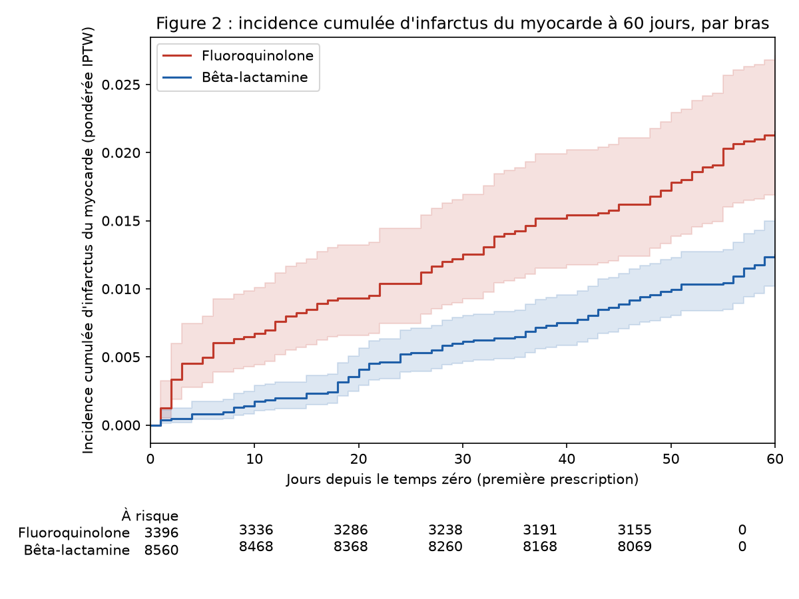
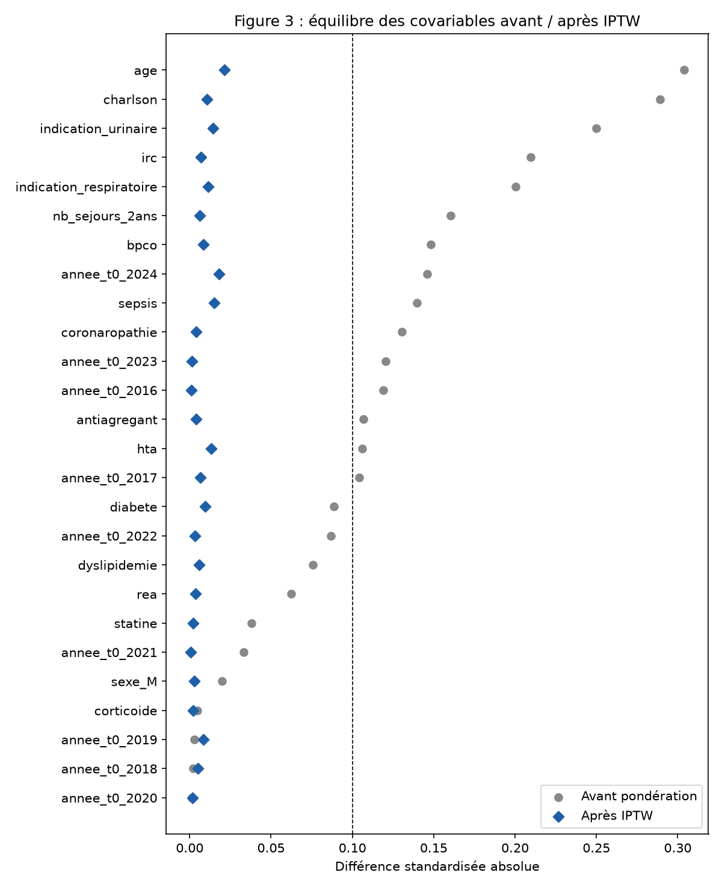

# Tableaux et figures de l'analyse (exemple sur données synthétiques)

> Généré par les scripts 30_table1.py et 40_primary.py sur `data/cohorte_synthetique.csv` (jeu SYNTHÉTIQUE : aucun patient réel, effet causal simulé HR = 1,4). Aucun chiffre n'est saisi à la main.

## Tableau 1 : caractéristiques de la population par bras

Moyenne (ET) ou médiane [Q1, Q3] pour les variables quantitatives ; n (%) sinon. SMD : différence standardisée fluoroquinolone vs bêta-lactamine (avant pondération). Effectifs < 10 masqués.

|                                                | Ensemble      | Bêta-lactamine   | Fluoroquinolone   |   SMD (BL,FQ) |
|:-----------------------------------------------|:--------------|:-----------------|:------------------|--------------:|
| n                                              | 12000         | 8568             | 3432              |               |
| Âge, années, moyenne (ET)                      | 63.6 (15.8)   | 62.3 (15.7)      | 67.0 (15.4)       |         0.304 |
| Indice de Charlson, médiane [Q1, Q3]           | 1.0 [0.0,2.0] | 1.0 [0.0,2.0]    | 1.0 [0.0,2.0]     |         0.289 |
| Séjours dans les 2 ans, médiane [Q1, Q3]       | 1.0 [0.0,2.0] | 1.0 [0.0,2.0]    | 1.0 [1.0,3.0]     |         0.16  |
| Durée de prescription, jours, médiane [Q1, Q3] | 8.0 [6.0,9.0] | 7.0 [6.0,9.0]    | 9.0 [6.0,12.0]    |         0.418 |
| Diabète, n (%)                                 | 2195 (18.3)   | 1482 (17.3)      | 713 (20.8)        |         0.089 |
| Hypertension artérielle, n (%)                 | 4523 (37.7)   | 3103 (36.2)      | 1420 (41.4)       |         0.106 |
| Dyslipidémie, n (%)                            | 2685 (22.4)   | 1839 (21.5)      | 846 (24.7)        |         0.076 |
| Coronaropathie (hors IDM), n (%)               | 1321 (11.0)   | 840 (9.8)        | 481 (14.0)        |         0.13  |
| Insuffisance rénale chronique, n (%)           | 1204 (10.0)   | 697 (8.1)        | 507 (14.8)        |         0.21  |
| BPCO, n (%)                                    | 1369 (11.4)   | 858 (10.0)       | 511 (14.9)        |         0.148 |
| Statine, n (%)                                 | 2703 (22.5)   | 1891 (22.1)      | 812 (23.7)        |         0.038 |
| Antiagrégant plaquettaire, n (%)               | 1780 (14.8)   | 1176 (13.7)      | 604 (17.6)        |         0.107 |
| Corticoïde, n (%)                              | 992 (8.3)     | 705 (8.2)        | 287 (8.4)         |         0.005 |
| Sepsis au séjour index, n (%)                  | 928 (7.7)     | 567 (6.6)        | 361 (10.5)        |         0.14  |
| Passage en réanimation, n (%)                  | 652 (5.4)     | 430 (5.0)        | 222 (6.5)         |         0.062 |
| Sexe, n (%) : F                                | 6320 (52.7)   | 4537 (53.0)      | 1783 (52.0)       |         0.02  |
| Sexe, n (%) : M                                | 5680 (47.3)   | 4031 (47.0)      | 1649 (48.0)       |               |
| Indication, n (%) : autre                      | 2424 (20.2)   | 1805 (21.1)      | 619 (18.0)        |         0.254 |
| Indication, n (%) : respiratoire               | 4168 (34.7)   | 3205 (37.4)      | 963 (28.1)        |               |
| Indication, n (%) : urinaire                   | 5408 (45.1)   | 3558 (41.5)      | 1850 (53.9)       |               |
| Année du temps zéro, n (%) : 2015              | 1136 (9.5)    | 702 (8.2)        | 434 (12.6)        |         0.288 |
| Année du temps zéro, n (%) : 2016              | 1170 (9.8)    | 746 (8.7)        | 424 (12.4)        |               |
| Année du temps zéro, n (%) : 2017              | 1175 (9.8)    | 761 (8.9)        | 414 (12.1)        |               |
| Année du temps zéro, n (%) : 2018              | 1190 (9.9)    | 848 (9.9)        | 342 (10.0)        |               |
| Année du temps zéro, n (%) : 2019              | 1213 (10.1)   | 864 (10.1)       | 349 (10.2)        |               |
| Année du temps zéro, n (%) : 2020              | 1199 (10.0)   | 857 (10.0)       | 342 (10.0)        |               |
| Année du temps zéro, n (%) : 2021              | 1171 (9.8)    | 860 (10.0)       | 311 (9.1)         |               |
| Année du temps zéro, n (%) : 2022              | 1219 (10.2)   | 933 (10.9)       | 286 (8.3)         |               |
| Année du temps zéro, n (%) : 2023              | 1276 (10.6)   | 999 (11.7)       | 277 (8.1)         |               |
| Année du temps zéro, n (%) : 2024              | 1251 (10.4)   | 998 (11.6)       | 253 (7.4)         |               |

## Tableau 2 : résultats principaux (critère primaire : infarctus du myocarde à 60 jours)

| Critère | Évènements / n (personne-jours), fluoroquinolone | Évènements / n (personne-jours), bêta-lactamine | HR brut (IC 95 %) | HR pondéré IPTW (IC 95 %) | Risque à 60 j FQ vs BL (pondéré) | Différence de risque |
|---|---|---|---|---|---|---|
| Infarctus du myocarde (DP I21.*/I22.*) | 87 / 3432 (195388) | 91 / 8568 (497942) | 2.43 (IC 95 % 1.81 à 3.27) | 1.75 (IC 95 % 1.28 à 2.37) | 2.15 % vs 1.25 % | +0.90 points |

Décès sans infarctus (évènement intercurrent, censuré) : 130 vs 187. Test de Schoenfeld (modèle pondéré) : p = 0.03. Poids IPTW stabilisés : min 0.49, max 2.03, 2.0 % tronqués. Covariables avec |SMD| > 0,1 après pondération : 0.

## Tableau 3a : équilibre des covariables (différences standardisées)

| covariable              |   SMD brute |   SMD pondérée |
|:------------------------|------------:|---------------:|
| age                     |       0.304 |          0.021 |
| charlson                |       0.289 |          0.011 |
| nb_sejours_2ans         |       0.16  |          0.006 |
| diabete                 |       0.089 |          0.009 |
| hta                     |       0.106 |          0.013 |
| dyslipidemie            |       0.076 |          0.006 |
| coronaropathie          |       0.13  |          0.004 |
| irc                     |       0.21  |          0.007 |
| bpco                    |       0.148 |          0.008 |
| statine                 |       0.038 |         -0.002 |
| antiagregant            |       0.107 |          0.004 |
| corticoide              |       0.005 |         -0.002 |
| sepsis                  |       0.14  |          0.015 |
| rea                     |       0.062 |          0.004 |
| sexe_M                  |       0.02  |         -0.003 |
| indication_respiratoire |      -0.2   |         -0.011 |
| indication_urinaire     |       0.25  |          0.014 |
| annee_t0_2016           |       0.119 |         -0.001 |
| annee_t0_2017           |       0.104 |          0.007 |
| annee_t0_2018           |       0.002 |          0.005 |
| annee_t0_2019           |       0.003 |          0.008 |
| annee_t0_2020           |      -0.001 |         -0.002 |
| annee_t0_2021           |      -0.033 |         -0.001 |
| annee_t0_2022           |      -0.087 |         -0.003 |
| annee_t0_2023           |      -0.121 |         -0.001 |
| annee_t0_2024           |      -0.146 |         -0.018 |

## Figure 2 : incidence cumulée d'infarctus du myocarde à 60 jours

## Figure 3 : love plot

