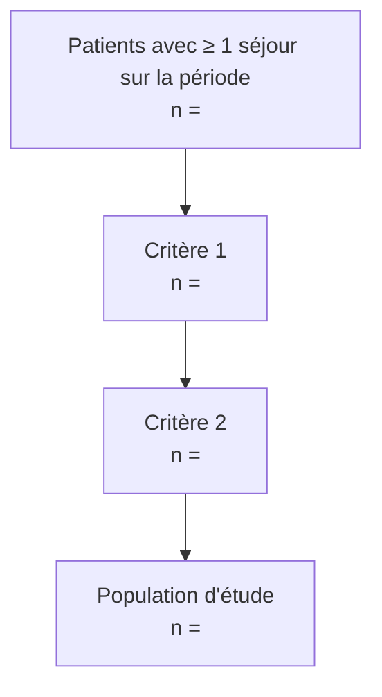

# Étude de faisabilité

## Mode d'exécution

| Élément | Valeur |
|---|---|
| Requêtes exécutées par | agent / humain |
| Date d'exécution | |
| Snapshot de l'EDS | |
| Environnement | |

## Diagramme de sélection

*« Une étape par critère d'éligibilité de 02-protocole, dans l'ordre du protocole ; effectifs masqués si < seuil. »*



## Effectifs

| Bras | Patients | Personnes-années | Évènements attendus | Évènements observés |
|---|---|---|---|---|
| | | | | |

## Description de la population

*« Petits effectifs masqués (« <10 »). »*

| Caractéristique | Modalité | n | % |
|---|---|---|---|
| Âge (classes) | | | |
| Sexe | | | |
| Année d'inclusion | | | |

## Qualité des données

*« Cadre de Kahn : complétude (valeur présente), plausibilité (valeur crédible), conformité (format et référentiel respectés). »*

| Variable | Complétude % | Plausibilité | Conformité | Commentaire |
|---|---|---|---|---|
| | | | | |

## Requêtes

*« Numérotées, reproductibles, chacune suivie de son résultat agrégé. »*

### Requête 1 : <objet>

```sql
```

Résultat :

### Requête 2 : <objet>

```sql
```

Résultat :

## Décision

- [ ] Go
- [ ] No-go
- [ ] Redéfinir

Justification : *« Effectifs suffisants au regard de la section 10 du protocole ? Variables clés disponibles ? Qualité acceptable ? »*

Conséquences sur le protocole : *« Lister les modifications à reporter dans 02-protocole et 03-phenotypes (critères, fenêtres, variables abandonnées). »*

## Historique

| Date | Auteur | Modification |
|---|---|---|
| <AAAA-MM-JJ> | <auteur> | Création |
